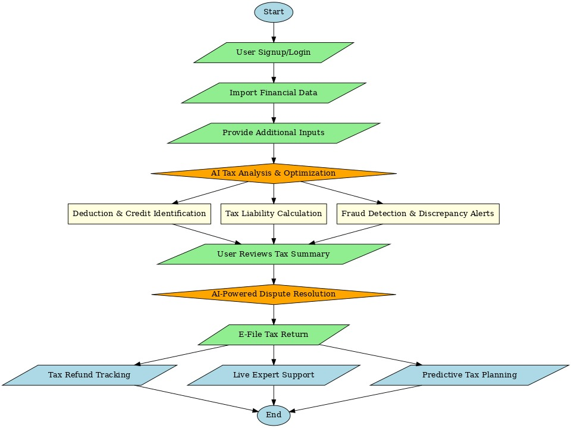
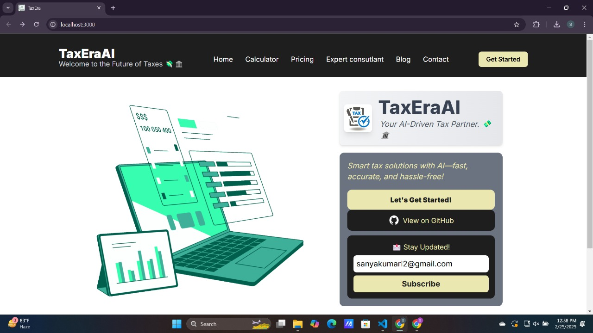
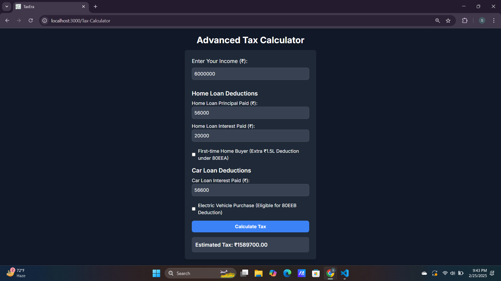
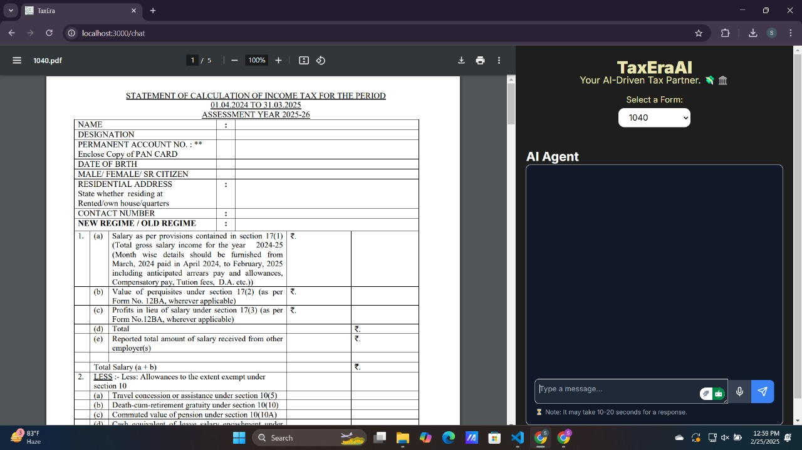

# TaxEraAI

## Overview
TaxEraAI is an AI-driven tax assistant that simplifies the tax filing process for individuals and businesses. Traditional tax filing can be complex, time-consuming, and prone to errors, often requiring professional assistance. TaxEraAI automates tax calculations, ensures compliance with tax regulations, and provides personalized insights, making tax management more efficient and stress-free.

## Solution Approach
TaxEraAI streamlines tax filing by integrating advanced AI models, automation, and real-time assistance. It offers features like automatic data import, real-time tax calculations, e-filing, and deduction optimization. Users receive proactive alerts, multilingual support, and role-based access, ensuring a smooth tax experience. With AI-driven dispute resolution and financial insights, TaxEraAI empowers users to make informed decisions while minimizing errors and penalties.

## How I Built It  

- **Frontend:** Built using **Next.js (React framework)** for server-side rendering (SSR) and static site generation (SSG), ensuring fast performance. Styled with **Tailwind CSS** for a clean and modern UI.  
- **Backend:** Implemented with **FastAPI (Python-based)** for high-speed API responses and seamless AI integration. Handles authentication, user management, and tax automation workflows.  
- **Database & APIs:**  
  - **MongoDB Atlas**: Cloud-based NoSQL database for scalable data storage.  
  - **Google Cloud Services**: Used for AI-driven automation, tax document processing, and cloud-based authentication.  
  - **Vertex AI (Google AI Platform)**: Powers intelligent tax calculations and chatbot assistance.  
  - **Plaid/Yodlee API**: Fetches real-time financial data securely for automated tax calculations.  
  - **Google Cloud Discovery Engine API**: Enables enhanced search and recommendation features.  
- **Authentication & Security:**  
  - **JWT (JSON Web Tokens)** for secure user authentication.  
  - **OAuth 2.0** for third-party integrations.  
  - **Google Cloud IAM** for role-based access control (RBAC).   
- **Testing & Monitoring:**  
  - **Postman** for API testing.  
  - **Google Cloud Logging & Monitoring** for real-time insights.  
  - **Jest & React Testing Library** for frontend testing.  

This ensures a **scalable, secure, and high-performance** tax automation platform. 🚀  

## Flowchart

## How It Works  

1. **User Authentication** – Secure login via **OAuth 2.0** or **JWT-based authentication**.  
2. **Data Collection** – Users input financial details or sync via **Plaid/Yodlee API**; OCR processes tax documents.  
3. **Tax Calculation** – **FastAPI backend** analyzes data using **Vertex AI** for optimized tax deductions.  
4. **Smart Recommendations** – AI suggests tax-saving strategies via **Google Cloud Discovery Engine API**.  
5. **Dashboard & Reports** – Users access interactive tax summaries, analytics, and downloadable reports.  
6. **Filing & Submission** – Generates tax reports for manual filing, with potential future e-filing integration.  
7. **Security & Compliance** – Encrypted data storage (**MongoDB Atlas**) with **Google Cloud IAM** role-based access.  

Ensuring **efficiency, accuracy, and security** in tax automation. 🚀  

## Demo Video
[Watch Demo](assets/video.mp4)

## Features  
**Home Page**  
  

**Automated Tax Calculation** – Uses AI to calculate taxes efficiently.  
  

**Chatbot Assistance** – Get instant tax support with AI-powered chatbot.  
  

 **Expert Advice** – Consult tax professionals for personalized guidance. 

 
**AI-Powered Tax Planning** – Optimize tax strategies with intelligent AI insights. 
  

 

- **User-Friendly Dashboard** – Interactive and easy-to-use UI.  
- **Secure Data Handling** – Ensures encrypted and safe storage of user information.  
- **Cross-Platform Compatibility** – Works on both desktop and mobile.  
- **Real-Time Analytics** – Provides insights and trends with live data.  
- **Customizable Settings** – Personalize features based on user preferences.  
- **And many more...** 🚀  

## Run it in Your Local Machine

### Steps to run the frontend:
1. Open Terminal or Command Prompt.  
2. Navigate to the `src/frontend` directory.  
3. Install dependencies using `npm install`.  
4. Start the development server with `npm run dev`.  
5. Open a browser and go to `http://localhost:3000`.  

### Steps to run the FastAPI backend:
1. Install dependencies using: `pip install fastapi uvicorn google-cloud-discoveryengine vertexai google-api-core`.  
2. Set up Google Cloud authentication by configuring service account credentials.  
3. Save the Python script as a `.py` file (e.g., `main.py`).  
4. Open a terminal and navigate to the script’s directory.  
5. Run the FastAPI server with: `uvicorn main:app --reload`.  
6. Access the API at `http://localhost:8000/docs` to test endpoints.  

## Acknowledgment
Special thanks to everyone who contributed to the development of TaxEraAI, including mentors, developers, and the open-source community for providing valuable resources and guidance.
